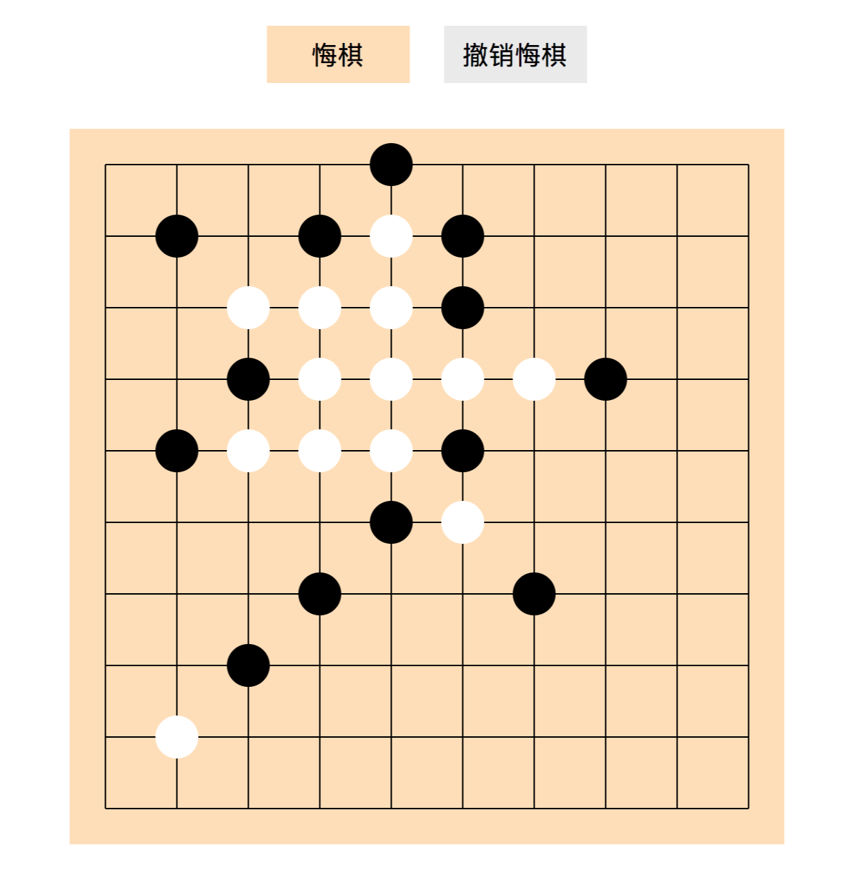

# fivepiece

在某次求职过程中，收到了一个笔试题，要求写一个人机对战的五子棋，题目要求如下：

>   请编写一个单机【五子棋】游戏，要求如下：
>
>   使用原生技术实现，兼容 Chrome 浏览器即可。
>
>   实现胜负判断，并给出赢棋提示；任意玩家赢得棋局，锁定棋盘。
>
>   请尽可能的考虑游戏的扩展性，界面可以使用 DOM / Canvas 实现。考虑后续切换界面实现的方式成本最低。（比如选择使用 DOM 实现界面，需求改变为使用 Canvas 实现时尽可能少的改动代码）。
>
>   实现一个悔棋功能
>
>   实现一个撤销悔棋功能
>
>   实现一个人机对战功能
>
>   尽可能的考虑实现的灵活性和扩展性

自己收到这个题目之后感觉有点棘手，自己没有开发过游戏，时间也比较紧。下班之后就开始弄了，简单介绍下自己的实现过程。

### 难点

*   机器人自动选择最佳可下棋子的位置
*   判断是否胜利

### 思路

*   选择dom方式实现，采用坐标系方式计算每个格子的值，对canvas不是太熟悉。
*   分离dom交互的部分，比如画棋盘，画棋子，悔棋等等。
*   分离人机对战逻辑部分，比如计算可下区域的逻辑，胜利的逻辑，机器人选择最佳棋子的逻辑，悔棋逻辑，撤销悔棋逻辑等等。

### 实现

dom交互部分比较简单，这里就不说了，只说说人机对战的逻辑部分。

要实现机器人自动对战，就要让机器人如何能自动选择最佳位置去下。我在实现的时候采用权重法，就是优先选择权重大的格子下，这样才能最大概率的战胜玩家。那么难点就是如何计算可下区域格子的权重大小呢？我把棋盘采用坐标系的方式表示，对每个格子都有一个固定的值，先计算出可选择区域的格子，然后对每个格子计算出这个格子当前的权重（权重和棋子值不一样）。

第二个难点就是判断每一步都是否胜利结束游戏，五子棋胜利的判断就是一方连续5颗棋子，方向有水平方向，垂直方向，45度方向和135度方向，任意一个方向满足都视为胜利。采用坐标法，那么这个计算就非常简单。

*   当前棋子权重计算

    当前棋子权重的计算，考虑到如何最有利于自己获胜，

    当前棋子在当前方向的权重，计算规则：

    1.  遇到，是机器人的棋子，则加10
    2.  遇到，当前格子还是可下区域，则加1

    ```javascript
    if (outerMin >= lineMin && outerMin <= lineMax) {
      if (~currents.indexOf(outerMin)) {
        winWeight += 10;
      } else if (!~havenBoardStatus.indexOf(outerMin)) {
        winWeight += 1;
      }
    }
    if (outerMax >= lineMin && outerMax <= lineMax) {
      if (~currents.indexOf(outerMax)) {
        winWeight += 10;
      } else if (!~havenBoardStatus.indexOf(outerMax)) {
        winWeight += 1;
      }
    }
    ```

*   优先级的逻辑

    再计算了权重之后，首先要考虑优先级，比如成五比其他情况都优先。

    优先级规则如下：

    1.  当前格子能使自己成五胜利，优先级最高，1
    2.  当前格子下了之后，可成四的线路，如果有多条线路，则优先级其次，2。
    3.  当前格子下了之后，可否使自己成四，并且阻止玩家成四，优先级为3。
    4.  当前格子下了之后，可否使自己成四，并且使自己其他线路成三，优先级为4。
    5.  当前格子下了之后，可否使自己成四，并且阻止玩家成三，优先级为5。
    6.  当前格子下了之后，可否阻止玩家成多条线路的四，优先级为6。
    7.  当前格子下了之后，可否阻止玩家成四，并且其他线路成三，优先级为7。
    8.  以此类推…...

### 效果

写完了之后，反正我自己是很难赢这个机器人了，界面效果图如下：



如果想挑战一下的可以开始：[https://snayan.github.io/fivepiece/](https://snayan.github.io/fivepiece/)

